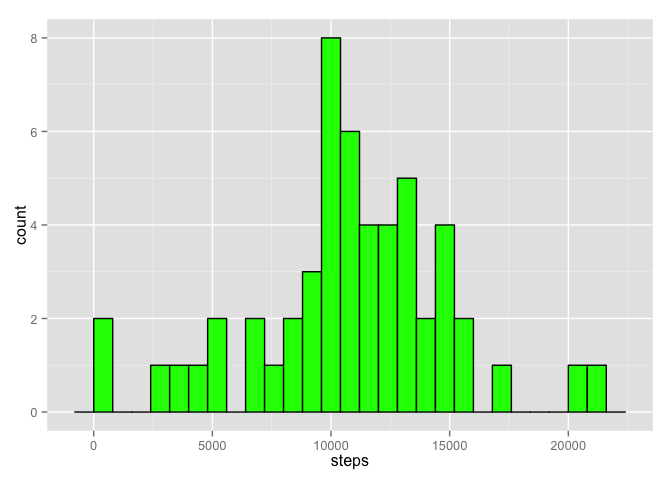
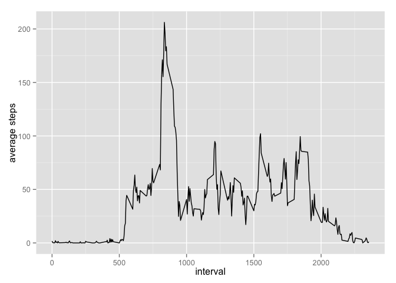
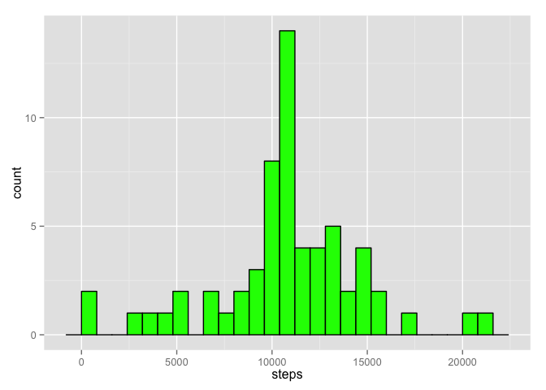
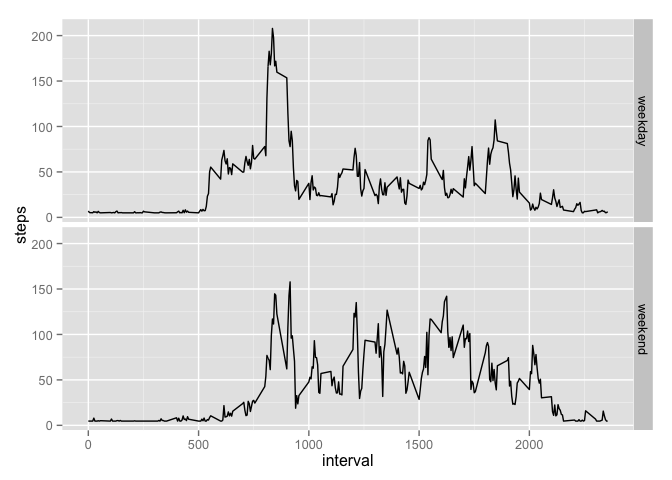

# Reproducible Research: Peer Assessment 1


## Loading and preprocessing the data

```r
library(lubridate)
library(dplyr)
```

```
## 
## Attaching package: 'dplyr'
## 
## The following objects are masked from 'package:lubridate':
## 
##     intersect, setdiff, union
## 
## The following object is masked from 'package:stats':
## 
##     filter
## 
## The following objects are masked from 'package:base':
## 
##     intersect, setdiff, setequal, union
```

```r
Steps<- read.csv("activity.csv", header = TRUE)
    Steps$date <- ymd(Steps$date)
Steps_DF <- tbl_df(Steps)
```


## What is mean total number of steps taken per day?

```r
library(ggplot2)
Psum <- summarise(group_by(Steps_DF, date), steps = sum(steps))
Psum <- na.omit(Psum)
    ggplot(Psum, aes(steps)) + geom_histogram(fill= "green", colour = "black", binwidth = 800)
```

 


The avarage steps per day is 

```r
mean(Psum$steps)
```

```
## [1] 10766.19
```
The Median steps per day is.

```r
median(Psum$steps)
```

```
## [1] 10765
```

I find it suprising that the mean and median are so close together.

## What is the average daily activity pattern?

```r
OM_Steps_DF <- na.omit(Steps_DF)       
    by_interval_mean_steps <- summarise(group_by(OM_Steps_DF, interval), steps = mean(steps))
        qplot(by_interval_mean_steps$interval, by_interval_mean_steps$steps, geom = "line", xlab= "interval", ylab = "average steps")
```

 

This person tends to go for walks/runs around 8:30am.

```r
        by_interval_mean_steps[which.max(by_interval_mean_steps$steps),]
```

```
## Source: local data frame [1 x 2]
## 
##   interval    steps
## 1      835 206.1698
```

There highest average count of steps is around 8:35 am.

## Imputing missing values

To fill in the NA values I replaced each day with the mean value of steps for the day.  This is under the assumtion that if a day has an NA value the whole day is NA. Because of this when it cames to breaking it down by intervale I added the mean by the interval for the weekday/weekend graph.  In other words I applied both methods based on the outcome I was looking for in the graph.  Not exactly scientific but close enough.  

```r
sum(is.na(Steps_DF$steps))
```

```
## [1] 2304
```
     total number of NA in steps in the data for the variable steps


```r
Steps_DF_full <- Steps_DF
    Steps_DF_full <- summarise(group_by(Steps_DF_full, date), steps = sum(steps))
    Steps_DF_full$steps[which(is.na(Steps_DF_full$steps))]  <-  mean(Steps_DF_full$steps, na.rm = TRUE)
    ggplot(Steps_DF_full, aes(steps)) + geom_histogram(fill= "green", colour = "black", binwidth = 800)
```

 

```r
    mean(Steps_DF_full$steps)
```

```
## [1] 10766.19
```

```r
    median(Steps_DF_full$steps)
```

```
## [1] 10766.19
```

## Are there differences in activity patterns between weekdays and weekends?


```r
Steps_DF_day <- mutate(Steps_DF, dayss = weekdays(date))
    Steps_DF_day$steps[which(is.na(Steps_DF_day$steps))] <- mean(Steps_DF_day$steps, na.rm=T)
Steps_DF_day$dayss <- ifelse(grepl('^S', weekdays(Steps_DF_day$date)), "weekend", "weekday")
Psum_full2 <- summarise(group_by(Steps_DF_day, interval, dayss), steps=mean(steps))
qplot(interval, steps, data=Psum_full2, geom="line", facets= dayss ~.)
```

 
